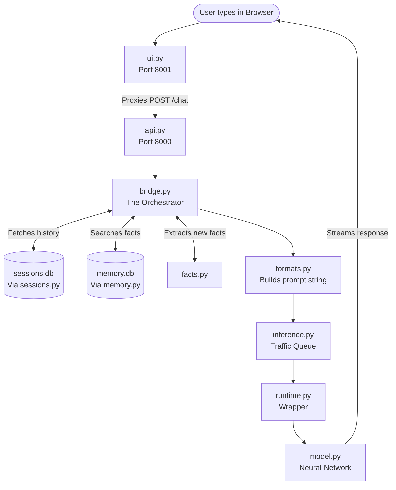
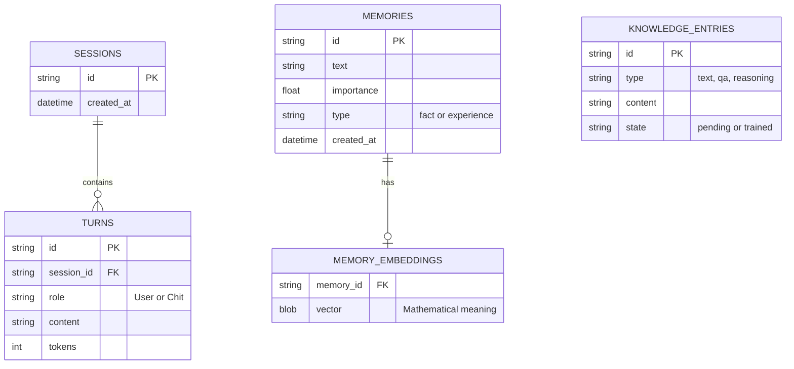
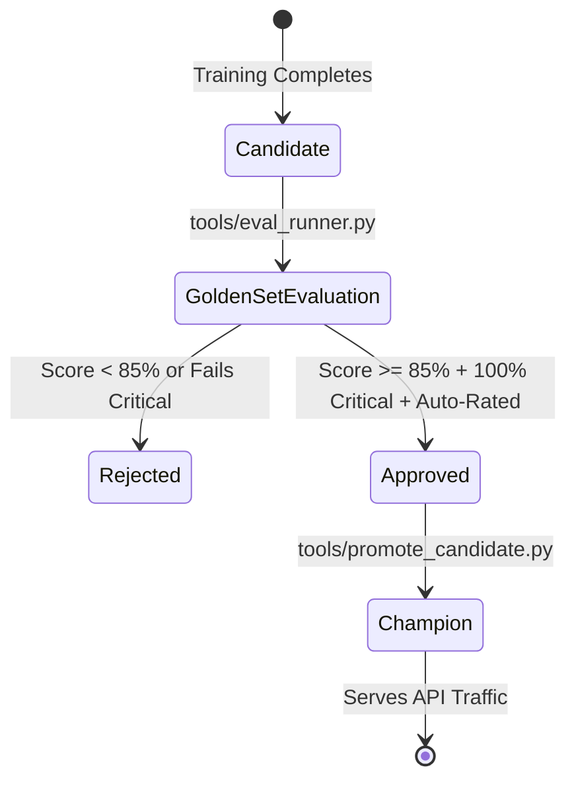
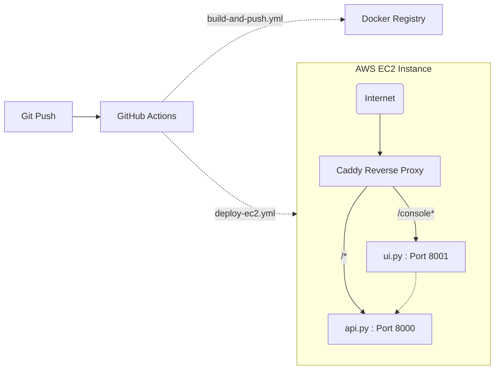

# Chit Project Index & Comprehensive Reference Manual

> **Purpose**: This document is the single authoritative guide to the Chit codebase. It is written in simple English to help you find bugs, understand how parts connect (wiring), and add features without breaking existing expectations. 

---

## 1. Executive Summary & Glossary

Chit (चित्, Sanskrit for *mind*) is a custom AI language model (a neural network) built from scratch. It is the cognitive engine inside a larger assistant system called **Atmini**.

### The Golden Rule: Brain vs. Notebook
Chit strictly separates its *brain structure* from its *memories*. 
1. **The Brain (Neural Weights)**: Stored in `checkpoints/`. This is what the model learns permanently during *training*.
2. **The Notebook (Databases)**: Stored in SQLite (`data/memory.db`, `data/knowledge.db`, `data/sessions.db`). These are facts, past conversations, and rules it looks up dynamically. 

If you want Chit to learn a new language pattern, you **train** it. If you want Chit to remember a user's name, you **save a memory**. Do not mix these up.

### Glossary of Terms
- **Champion**: The active, live AI model currently answering user queries (`checkpoints/latest.pt`).
- **Candidate**: A newly trained AI model (`checkpoints/jobs/<id>/latest.pt`) waiting to pass tests before it can become the Champion.
- **Memory**: A specific fact about a user or the world, saved in `memory.db`.
- **Knowledge / Lesson**: A curated fact or rule in `knowledge.db` waiting to be permanently trained into the AI's weights later.
- **Golden Set**: A strict 50-question test the Candidate must pass to become the Champion.

---

## 2. System Architecture & Data Flow Visualized

### The Chat Request Journey
When a user sends a message, here is exactly how the files talk to each other:

### Context Budget & Prompt Trimming Hierarchy
The AI has a strict reading limit (`block_size`, typically 256 or 512 tokens). When the `Bridge` gathers too much history and memory, `formats.py` deletes information in this strict priority order to prevent crashes:

1. **Oldest Session Turns**: Distant chat history is forgotten first.
2. **Conversation Summary**: If a summary of old chats exists, it is dropped next.
3. **Lowest-Ranked Memories**: Contextual facts with low semantic relevance are dropped.
4. **Oldest Extracted Facts**: Direct core facts (like user preferences) are highly protected but dropped if desperate.
5. **Current User Input**: As an absolute last resort, the user's current message is truncated.

---

## 3. Core Algorithms & Mechanisms (The "How")

Beyond moving data, the system performs several intelligent background tasks:

- **Fact Extraction (`facts.py`)**: It does *not* use AI to extract facts. It uses lightning-fast, deterministic Regular Expressions (Regex) to spot patterns like `name`, `location`, `preference`, and `goal` in user messages.
- **Background Summarization (`summarization.py`)**: It runs a deduplicated extractive summarizer. When a chat session gets too long, it condenses the oldest messages into a short summary block so the AI doesn't have to re-read the whole conversation.
- **Semantic Search (`embeddings.py` & `faiss_index.py`)**: When you save a memory, it is converted into a mathematical array (vector) using `SentenceTransformers`. When the user asks a question, the system finds the closest matching vectors using FAISS (a high-speed search library) or exact cosine similarity if FAISS isn't installed.

---

## 4. Database Schemas (The Notebook)

The system relies on SQLite for zero-ops, local dynamic storage. Here is the Entity-Relationship structure connecting conversations to memories.

*Note: `MEMORIES` utilizes SQLite FTS5 (Full-Text Search) for rapid keyword matching alongside semantic vector matching.*

---

## 5. Security & Authentication Model

Because Chit is a personal assistant, protecting its data is critical.
- **Backend API (Port 8000)**: Completely stateless. Every request must include the `CHIT_API_KEY` either as an `X-API-Key` header or a `Bearer` token.
- **Browser UI (Port 8001)**: Stateful. Users log in with the API key. The server verifies it and issues a strictly locked-down cookie (`chit_console_key`). This cookie is `HttpOnly` (immune to JavaScript XSS) and `SameSite=Strict` (immune to CSRF).

---

## 5. UI Features & Philosophy

The Chit UI (`ui.py` & `app.js`) is the primary way to interact with the system. It strictly wraps the API.
- **Universal Page Guides**: Every UI view has a "Page Guide" button that explicitly maps friendly UI terms to their underlying JSON API payloads (e.g. mapping "Text reader" to `tokenizer`, or "Learn from scratch" to `init_checkpoint: null`).
- **Real-Time System Metrics**: The UI header features a live CPU/Mem/Disk badge polling `GET /sys_metrics` every 2 seconds.
- **Unified Training & Candidates**: The Studio UI lists training jobs and immediately surfaces their associated Golden Gate evaluations, file timestamps, and promotion buttons once completed.

## 6. Directory & Module Map (Wiring)

### Core AI Brain (The Neural Network)
| File | Purpose | Wiring | API / UI Exposure |
|---|---|---|---|
| `model.py` | Math of the AI brain (Transformer, RoPE). | Wires to `training.py` and `runtime.py`. | `GET /model` |
| `tokenizer.py` | Translates human text to AI tokens. | Used globally for text processing. | Internal only. |
| `config.py` | Enforces JSON settings schema safely. | Loaded during training jobs. | Payload validation. |

### Orchestration & Prompting (The Bridge)
| File | Purpose | Wiring | API / UI Exposure |
|---|---|---|---|
| `bridge.py` | Gathers memories, history, and user prompt. | Connects `api.py` to `memory/sessions`. | Powers `POST /chat`. |
| `formats.py` | Executes the prompt trimming hierarchy. | Called by `bridge.py`. | Internal only. |
| `inference.py` | Queue system protecting CPU from overload. | Called by `bridge.py` and `api.py`. | Protects generation. |
| `runtime.py` | Wrapper bundling model, tokenizer, memory. | Booted in `api.py`. | Core server engine. |

### Memory & Knowledge Databases (The Notebook)
| File | Purpose | Wiring | API / UI Exposure |
|---|---|---|---|
| `memory.py` | Searches facts via FTS5 and Vectors. | Called by `bridge.py`. | `POST /memory` |
| `faiss_index.py` | Speed-boost module for vector searches. | Plugs into `memory.py`. | Invisible speedup. |
| `embeddings.py` | Converts text to meaning vectors. | Plugs into `memory.py`. | Invisible dependency. |
| `sessions.py` | Remembers chat history. | Called by `bridge.py`. | `GET /sessions`. |
| `facts.py` | Auto-extracts facts from user messages. | Called by `bridge.py`. | Triggers during chat. |
| `summarization.py`| Shrinks old conversations into summaries. | Background in `sessions.py`. | Invisible optimization. |
| `knowledge.py` | Staging area for facts to be trained later. | Feeds `training.py`. | `GET /knowledge` |

### Training & Operations
| File | Purpose | Wiring | API / UI Exposure |
|---|---|---|---|
| `training.py` | Updates the neural network weights. | Takes `datasets.py` $\to$ updates `model.py`. | Runs during `/train`. |
| `datasets.py` / `data.py` | Reads `.txt` files based on weight %. | Feeds `training.py`. | Configured via JSON. |
| `jobs.py` | Background training queue (1 job max). | Called by `api.py`. | `GET /train/{job_id}` |
| `promotion_state.py`| Swaps Candidate for live Champion. | Used by API / CLI. | UI "Promote" buttons. |

---

## 7. How to Add Features or Fix Bugs Safely

1. **Adding a new API Endpoint**: Add the route in `api.py`. If the UI needs it, **must** update the `ROUTES` list in `ui.py`.
2. **Changing AI Answers**: Do not write code. Add a fact via `/memory` or "Teach Chit".
3. **Prompt Layout**: Edit `formats.py`.
4. **Retrieval Logic**: Edit `bridge.py`.
5. **Training**: The AI only learns from `.txt` files listed in `.json` configs. Changing `.txt` files requires running a new training job to take effect.
6. **UI Elements**: Be careful with Jinja2 whitespace in `ui/templates/index.html` (e.g. `{{ base_path | tojson }}`).

---

## 8. Checkpoint Rules: Candidate vs Champion

**Safeguard:** The Champion is *never* automatically replaced unless you explicitly pass `force_promote: true` via the API. 

---

## 9. Datasets (`.txt`) and Configs (`.json`)

### Core Datasets
- **Small**: `data/train.txt` (45 KB) - fast CPU sanity tests.
- **Large**: `data/train_1mb.txt` and `data/english_foundation/*.txt` - grammar, logic, conversation.
- **Reasoning**: `data/reasoning.jsonl` (253 KB) - parsed dynamically by `reasoning.py` into step-by-step logic.
*(Note: `scripts/generate_english_foundation_from_data2.py` automatically expands foundation files up to 1 MB).*

### Config Tiers (`configs/*.json`)
1. **Bootstrap**: `chit_cpu_learning.json`, `chit_tiny.json` (64-128 tokens).
2. **Experiments**: `chit_byte_experiment.json`, `chit_rope_512_rescue.json` (Architecture tests).
3. **Foundation**: `chit_english_foundation.json` (512 context, multi-source mixing).
4. **Deep**: `chit_v2_6l_256.json` (6-layer, 256-dim, up to 8 data sources).

---

## 10. Infrastructure, Topology & CI/CD

Chit is deployed on AWS EC2 (`t4g.small` ARM64). Automated GitHub Actions handle deployment so you never have to SSH manually.

**CRITICAL RULE**: The API server *must* run with a single worker (`--workers 1`). Memory, training, and traffic queues live in process memory. Multiple workers cause split-brain memory thrashing.

---

## 11. Testing Philosophy & Safeguards

The project contains 137 tests driven by `pytest`.
- **Mocks & Safety (`conftest.py`)**: Intercepts database paths and redirects them to in-memory databases (`:memory:`). Running tests will never overwrite your live `memory.db`.
- **API Key Overrides**: Tests use a dummy key (`KEY = "test-ui-key"`).

---

## 12. Environment Variables (`.env`)

| Variable | Default | Purpose |
|---|---|---|
| `CHIT_API_KEY` | `change-me` | Required password for API/UI. |
| `CHIT_MEMORY_ANN` | `auto` | `auto` uses FAISS; falls back to cosine otherwise. |
| `CHIT_WITH_EMBEDDINGS` | `0` | Set `1` to install local sentence-transformers. |

---

## 13. Common Troubleshooting & Gotchas

- **"QueueFullError" (HTTP 503)**: The queue in `inference.py` is full (max 32). CPU is protected.
- **Model outputs "The the the..."**: Model collapsed. Learning rate too high or step count too low for context size.
- **Golden Set yields 0/50**: Check model `block_size`. Prompts require ~200 tokens. 64-token models fail automatically.
- **ModuleNotFoundError: pranav**: Run commands as modules from root (e.g., `python -m pytest`).

---

## 14. Operational Commands

- **Run API (8000)**: `python -m uvicorn pranav.chit.api:app --port 8000 --workers 1`
- **Run UI (8001)**: `python -m uvicorn pranav.chit.ui:app --port 8001 --workers 1`
- **Run tests**: `python -m pytest`
- **Train model**: `python -m pranav.chit.tools.train --config configs/chit_strong.json`
- **Evaluate**: Use the 'Evaluate Model' button in the Studio UI (Calls `POST /candidates/{job_id}/evaluate`)
- **Promote**: Use the 'Promote to Live' button in the Studio UI (Calls `POST /candidates/{job_id}/promote`)

## Model Candidates and Administration

These routes allow you to review completed training runs and safely swap the live model in production.

### GET /candidates
Returns a list of all finished candidate models (`state: "succeeded"` or `"success"`), their candidate checkpoint modification timestamps (`checkpoint_timestamp`), and their Golden Gate evaluation scores.

### POST /candidates/{job_id}/evaluate
Starts a background evaluation of a candidate model against the 50 Golden Gate behavioral prompts. 

### POST /candidates/{job_id}/promote
Promotes an evaluated candidate to be the live Champion, safely hot-swapping the active model. **Requirement:** The candidate must pass the Golden Gate evaluation.

### POST /admin/rollback
Instantly restores the previous live model (Champion) from the archive if a promoted candidate starts behaving poorly.
- **Parameters:** 	o_sha256 (the exact hash of the previous model to restore).

### POST /admin/reload
Force-reloads the active Champion model from the disk into memory.
